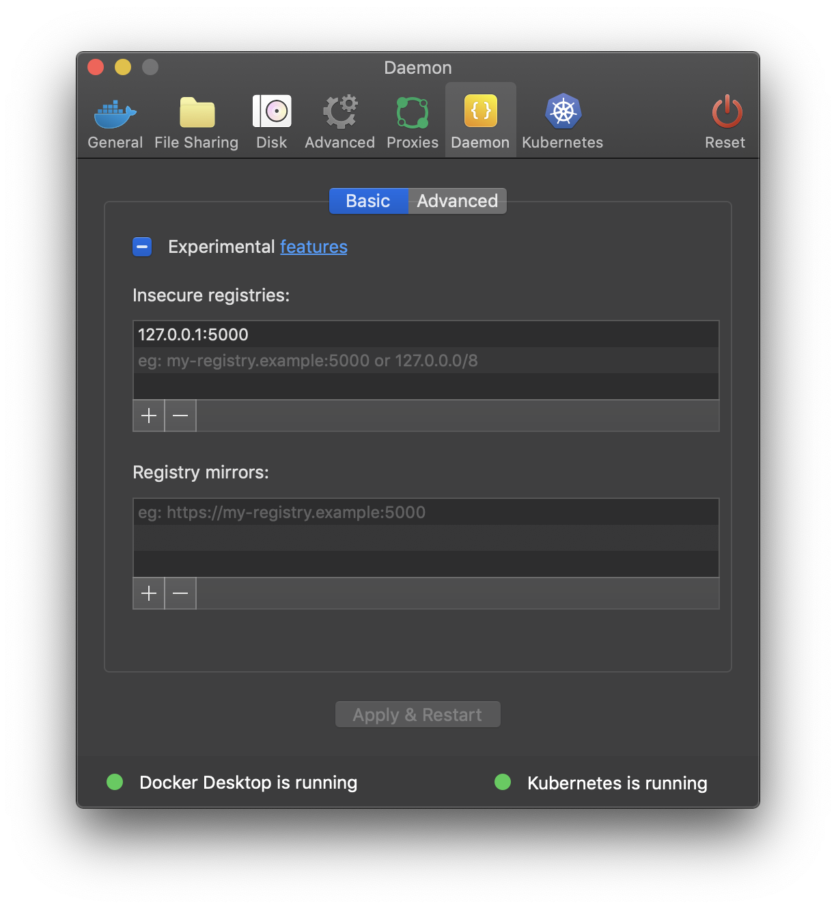

# akka-http on Kubernetes 

##### I created this project for better understanding of Kubernetes. To understand the difference between Service, Deployment, Ingress etc., I decided to try it all out in practice. I don't use any cloud solutions, and I deploy everything locally on my machine (MacOS). So if you want to run the project locally on your computer, here is a list of things you need to do:
- Since I'm working locally, I'm using the `Docker for Mac` that installs the `Docker`. Then you can enable support for `Kubernetes`, which will install the `Kubernetes` cluster with single node. You can also use `Minikube` or alternative solutions for `Windows`.
- You will need to create insecure repository by command `docker run -d -p 5000:5000 --restart=always --name registry registry:2`, you can change mapped port if you like.
- Once created, you will need to configure local registry in `Docker for Mac` app by specifying the address and port 

- After installation and configuration, you can run the script in `build.sh` or build an image and push it to the registry.
- Once you have your image in registry, you can apply deployments in `k8s` folder. Just run `kubectl apply -f *.yaml`

## To be continued...